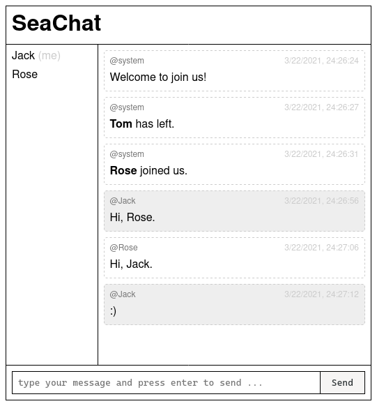

# SeaChat

chat app example built on express and socket.io


[](https://github.com/archtaurus/p5js-cli/actions/workflows/publish.yml)
[](https://www.npmjs.com/package/p5js)
[](https://github.com/archtaurus/p5js-cli/blob/master/LICENSE)
[](https://www.npmjs.com/package/p5js?activeTab=dependencies)
[](https://github.com/archtaurus/p5js-cli)
[](https://www.npmjs.com/package/p5js)

[](https://david-dm.org/archtaurus/seachat)
[](https://travis-ci.com/archtaurus/seachat)
[](https://github.com/archtaurus/seachat/actions/workflows/node.js.yml)



## 🐙 Install

``` shell
npm i -g seachat
```

## 💡 Usage

✨ Start the server

``` shell
seachat -p
firefox http://localhost:8000
```

## Features

- [X] simple, clear and customizable responsive UI
- [X] support for username
- [X] show user connection/disconnection notification
- [X] list online users
- [ ] private chatting
- [ ] chatting channels
- [ ] show “{user} is typing”
- [ ] browse chatting history
