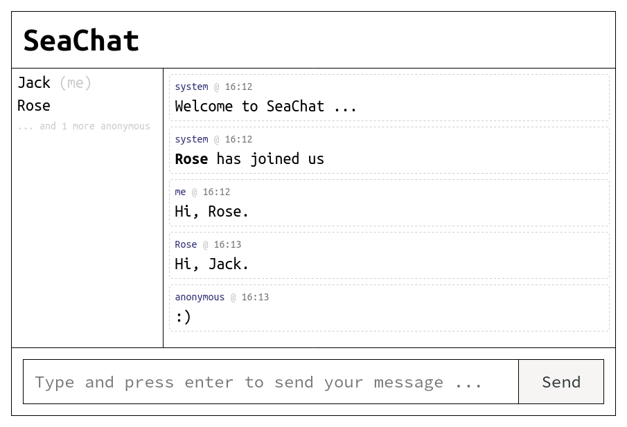

# SeaChat

chat app example using socket.io

[](https://travis-ci.com/archtaurus/seachat)

[](https://david-dm.org/archtaurus/seachat)



## Run

``` shell
yarn install
yarn dev
firefox http://localhost:8000
```

## Features

- [X] simple, clear and customizable responsive UI
- [X] support for username
- [X] show user connection/disconnection notification
- [X] list online users
- [ ] private chatting
- [ ] chatting channels
- [ ] show “{user} is typing”
- [ ] browse chatting history

## History

- Version 1.1.0
  - upgrade dependencies
  - update style.css
  - android firefox client bug fixed

- Version 1.0.2
  - remove `moment` from dependencies.
  - add server side logging
  - make code clean and readable
  - rewrite comments
  - anonymous is not allowed

- Version 1.0.1
  - remove `uuid` from dependencies, it's not needed for this app.
  - client = io(); because `client.id` is just the `client.io.id`.
  - minor bug fixed

- Version 1.0.0
  - first release
